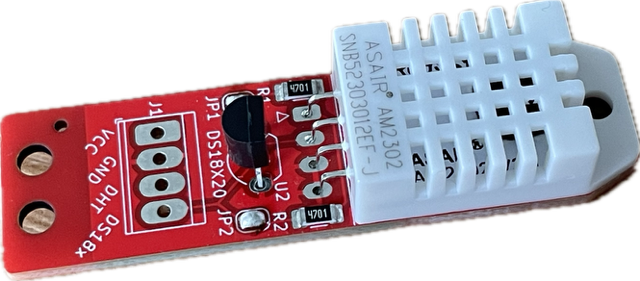

# AM2302-Sensor Library
[](https://github.com/hasenradball/AM2302-Sensor/actions/workflows/spell_checker.yml)
[](https://github.com/hasenradball/AM2302-Sensor/actions/workflows/compile_examples.yml)

Sensor Library for the AM2302 Sensor (aka DHT22) from ASAIR.<br>
This Library is a controller independent library for reading the AM2302 Sensor also known as DHT22.




## Contents
* [Sensor Documentation](#sensor-documentation)
* [AM2302 Library Usage](#library-usage)
* [License](#license)
* [Helpful Links](#helpful-links)

## Sensor Documentation
One small Docu you will find in the docs folder of this repo.

The actual manufacturer page is linked here: [ASAIR AM2302](http://www.aosong.com/en/products-22.html).

The most detailed datasheet you will find here: [AM2302 Product Manual](http://akizukidenshi.com/download/ds/aosong/AM2302.pdf)


**REMARK**:<br>
Against the most documentations and datasheets the following Pin description is correct (from left to right):

* Pin1: VDD (3,3...5 V)
* Pin2: SDA (Serial Data, two way)
* Pin3: GND
* PIN4: GND


## Library Usage
### Controllers
The library is intended to be used on each microcontroller for Example:<br>
* Arnuino Nano
* Arduino Nano 33 IOT
* ESP8266
* ESP32
* etc ...

### Usage the AM2302-Sensor library in the Code
Include the library

```
#include <AM2302-Sensor.h>
```

The library use namespaces, so the object can be instantiated and used by:

```
AM2302::AM2302_Sensor am2302{PIN};

void setup() {
  am2302.begin();

  auto status = am2302.read();
  Serial.print("\n\nstatus of sensor read(): ");
  Serial.println(status);

  Serial.print("Temperature: ");
  Serial.println(am2302.get_Temperature());

  Serial.print("Humidity:    ");
  Serial.println(am2302.get_Humidity());
}

```
### Status Codes of AM2302-Sensor
The following status codes exists:

* AM2302_READ_OK          {0};
* AM2302_ERROR_CHECKSUM   {-1};
* AM2302_ERROR_TIMEOUT    {-2};
* AM2302_ERROR_READ_FREQ  {-3};


# License
This library is licensed under MIT Licence.

[AM2302-Sensor License](https://github.com/hasenradball/AM2302-Sensor/blob/master/LICENSE)


# Helpful Links
* [ESP8266-01-Adapter](https://esp8266-01-adapter.de)
